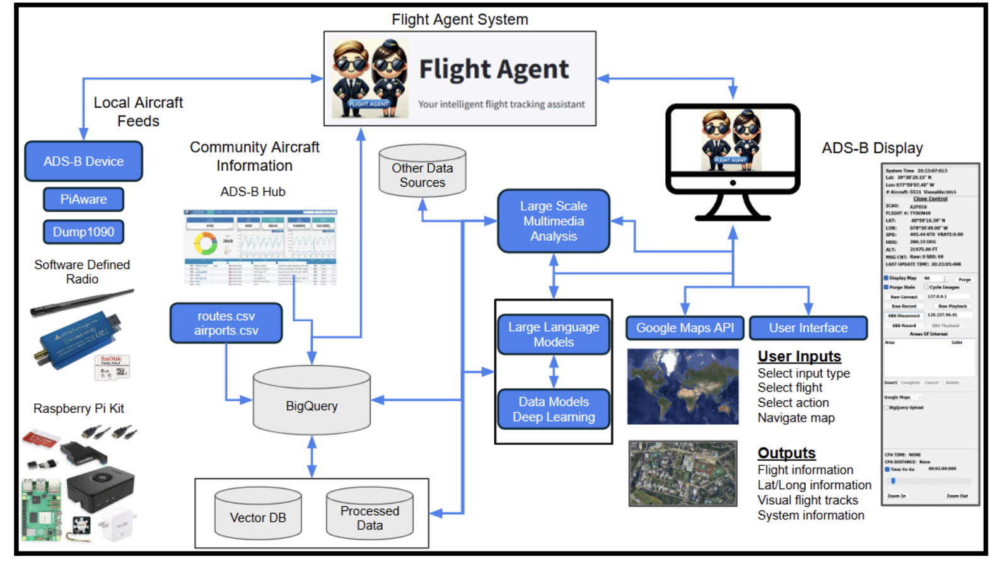

# IITP-AI-Studio-Project-Team2

It is a team project that collects and visualizes aircraft data using a Raspberry Pi and an ADS-B receiver, while developing AI-driven analytics based on BigQuery. The goal is to build an intelligent flight tracking system (IFTA) that integrates voice commands, large language models (LLMs), and deep learning–based prediction features.
